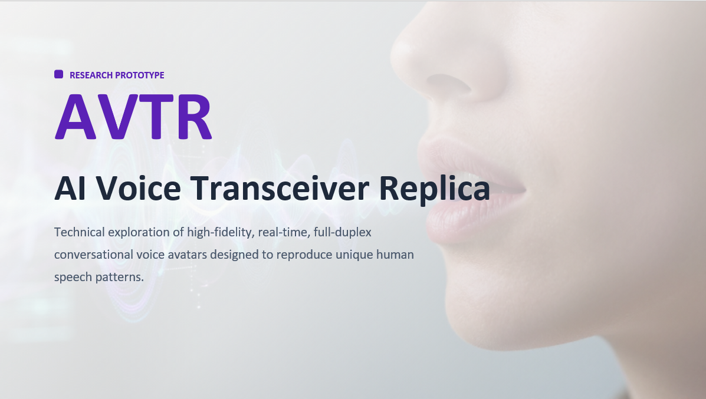

# AVTR: Real-Time Full-Duplex Voice Clone with Async Retrieval

<p align="center">
  
</p>


**A personalized Moshi-based conversational voice system that combines
voice cloning, natural turn-taking, and asynchronous retrieval without
blocking the real-time audio loop.**

AVTR extends the Moshi fine-tuning stack to explore a central question:
**Can a real-time conversational model sound like a specific person,
behave like that person in dialogue, and retrieve external information
without sacrificing conversational flow?**

The project builds on Kyutai's Moshi/Moshika architecture and LoRA
fine-tuning. The work progressed from successful single-speaker voice
cloning, through experiments on turn-taking behavior, to a two-speaker
dialogue training strategy and a Moshi-RAG integration path designed to
preserve full-duplex interaction while adding retrieval.

# 📑 Table of Contents

1.  [Project Motivation](#-project-motivation)
2.  [Overview of AVTR](#-overview-of-avtr)
3.  [Project](#-project)
    -   [AVTR's Voice: Personalized LoRA
        Fine-Tuning](#️-avtrs-voice-personalized-lora-fine-tuning)
    -   [AVTR's Conversation: Full-Duplex
        Turn-Taking](#️-avtrs-conversation-full-duplex-turn-taking)
    -   [AVTR's Intelligence: Async Streaming
        Retrieval](#-avtrs-intelligence-async-streaming-retrieval)
    -   [Integrated System Workflow](#-integrated-system-workflow)
    -   [Data Pipeline](#-data-pipeline)
    -   [Training and Evaluation](#-training-and-evaluation)
    -   [Experiments and Architecture
        Validation](#-experiments-and-architecture-validation)
    -   [AVTR's Evaluation: Retrieval Probing and Demo
        Harness](#-avtrs-evaluation-retrieval-probing-and-demo-harness)
    -   [Repository Components](#-repository-components)
4.  [Future Work](#-future-work)
5.  [Tools Utilized](#️-tools-utilized)

# 💡 Project Motivation

Many everyday phone conversations are necessary but repetitive: calling
a pharmacy, checking availability, coordinating an appointment, or
following up on a routine request. These tasks often require a person to
spend time waiting, repeating information, and navigating a conversation
even when little human judgment is required.

AVTR began with a simple idea:

> **What if you could create a conversational avatar that could speak
> and interact like you?**

Modern speech systems can generate highly realistic audio, but
reproducing a person in a live conversation requires more than
text-to-speech. A useful conversational avatar must preserve several
capabilities at once:

-   **Voice identity** --- reproduce the target speaker's vocal
    characteristics and prosody.
-   **Natural turn-taking** --- listen, speak, pause, yield, overlap,
    and backchannel naturally.
-   **Low-latency interaction** --- maintain a continuous real-time
    audio experience.
-   **Contextual intelligence** --- access information beyond the
    model's immediate context.
-   **Non-blocking retrieval** --- retrieve information without freezing
    the live conversation.

AVTR investigates how these capabilities can be combined in a single
Moshi-based architecture.

# 📣 Overview of AVTR

AVTR is a **real-time, full-duplex conversational voice clone** built
around Moshi/Moshika and LoRA adaptation.

The project separates the system into two cooperating paths:

**Front End --- Real-Time Audio**

Moshi handles the live full-duplex conversation. A personalized LoRA
adapter modifies the model toward the target voice and conversational
behavior. In parallel, streaming ASR produces text that can be used to
initiate retrieval.

**Back End --- Retrieval**

Retrieval runs asynchronously and is not bound by the real-time audio
loop. It can use an LLM, search system, or another knowledge source to
obtain relevant information. Retrieved context is then injected back
into the conversation.

This architecture is intended to keep the interaction responsive while
allowing AVTR to access information that would otherwise be unavailable
to the base conversational model.

## Key Features

-   **High-fidelity voice adaptation** using LoRA rather than full-model
    fine-tuning.
-   **Full-duplex speech interaction** through Moshi's native
    speech-to-speech architecture.
-   **Dialogue-aware training** using isolated speakers on separate
    stereo channels.
-   **Streaming ASR** to generate retrieval queries from the live
    conversation.
-   **Asynchronous retrieval** so external information gathering does
    not block the audio loop.
-   **RAG-compatible adapter strategy** for applying a personalized
    voice model over the Moshi-RAG serving stack.
-   **Checkpointed training and evaluation** with configurable LoRA
    rank, sequence duration, learning rate, and evaluation cadence.
-   **Architecture validation experiments** to determine where voice
    identity and turn-taking behavior are represented.

## 🧭 Repository Layout

AVTR spans two repositories, present here as subfolders:

-   **[`moshi_proj/`](./moshi_proj)**: the fine-tuning system this
    document covers below. File paths referenced from here on
    (`train.py`, `scripts/prepare_stereo.py`, `finetune/...`) are
    relative to this folder.
-   **[`moshirag-evals/`](./moshirag-evals)**: the evaluation and
    demo harness covered in [AVTR's
    Evaluation](#-avtrs-evaluation-retrieval-probing-and-demo-harness)
    below.

# 🎢 Project

## 🗣️ AVTR's Voice: Personalized LoRA Fine-Tuning

The first objective was to determine whether Moshi could be adapted to
reproduce a specific speaker without retraining the entire 7B-parameter
model.

AVTR uses **LoRA (Low-Rank Adaptation)** to introduce a comparatively
small set of trainable parameters while leaving the base model largely
intact. The training pipeline supports configurable LoRA rank and
scaling, optional embedding fine-tuning, checkpointing, mixed precision,
and distributed training.

### Initial Voice-Cloning Experiment

The initial dataset contained approximately **58 minutes of
single-speaker audio**. Each mono recording was converted into the
stereo format expected by Moshi:

-   **Left channel:** target speaker / `SPEAKER_MAIN`
-   **Right channel:** silence

This experiment successfully imprinted the target voice. However, live
inference exposed an important failure mode: **the model tended to
monologue and ignore the user.**

The result showed that voice cloning alone was not enough. Because the
training examples taught the model that the second speaker never talked,
the model also learned an undesirable conversational pattern.

### What We Learned

A follow-up freeze-attention experiment tested whether voice identity
could be isolated from turn-taking by preventing attention layers from
adapting.

The result indicated that **voice characteristics and conversational
timing are both strongly tied to attention behavior**. Freezing
attention reduced the desired voice adaptation, meaning the project
could not simply protect turn-taking by excluding attention from LoRA
training.

The solution therefore shifted from a layer-selection problem to a
**data-design problem**.

## 🗨️ AVTR's Conversation: Full-Duplex Turn-Taking

The second phase replaces silent-user training examples with real
two-person conversations.

Moshi expects stereo dialogue where the model's speaker occupies the
left channel and the conversation partner occupies the right channel.
This structure gives the model examples of:

-   listening while another person speaks,
-   taking a turn,
-   yielding the floor,
-   conversational pauses,
-   interruptions and overlap,
-   backchannels,
-   response timing.

The dialogue-data design uses the target speaker consistently as
**channel 0 / `SPEAKER_MAIN`** and conversation partners as **channel
1**.

The prepared dialogue corpus documented in this repository contains
approximately **2.4 hours of conversation across multiple partners**. A
roughly **10-minute section from the middle of the longest
conversation** is reserved for evaluation, while the remaining audio is
used for training.

Long conversations do not need to be manually divided into 100-second
clips. The dataset implementation windows files internally according to
`duration_sec`, and the transcript alignment is sliced and rebased for
each training window.

## 🧠 AVTR's Intelligence: Async Streaming Retrieval

A conversational clone becomes substantially more useful when it can
access information that is not contained in the base model or immediate
conversation.

AVTR's retrieval design keeps this process **asynchronous**.

Streaming ASR listens to the conversation and provides a transcript to
the retrieval path. Retrieval can then run independently using an LLM,
search engine, or knowledge source. When useful information becomes
available, it is injected back into the Moshi conversation as reference
context.

The key architectural goal is that **retrieval should not determine the
speed of the conversation**. Moshi remains responsible for real-time
speech generation and turn-taking, while the retrieval backend can
operate on a different latency budget.

This creates two simultaneous loops:

1.  **Fast loop:** real-time full-duplex audio.
2.  **Slow loop:** transcription → retrieval → reference injection.

## 🔄 Integrated System Workflow

The diagram below summarizes the target integrated architecture.

<p align="center">
``
</p>

The **front end** contains the latency-sensitive components. Moshi
produces and receives real-time audio, while the LoRA adapter
personalizes the model. Streaming ASR simultaneously feeds the retrieval
process.

The **back end** is intentionally decoupled from the real-time limit.
Retrieval can take longer than a conversational audio frame because it
executes asynchronously. The resulting reference is returned to the
front end when available.

An important architectural observation from the project is that the
model's **attention weights participate in voice, turn-taking, and
retrieval behavior**. This makes training-data design and adapter
compatibility particularly important: optimizing one behavior can affect
the others.

## 📚 Data Pipeline

AVTR's training pipeline transforms raw audio into the stereo audio,
manifests, and timestamped alignments expected by Moshi.

### 1. Audio Preparation

`scripts/prepare_stereo.py` supports the original monologue experiment.
It:

-   reads mono WAV files,
-   normalizes filenames to snake case,
-   writes the target voice to the left channel,
-   creates a silent right channel,
-   preserves 24 kHz audio,
-   writes PCM-24 stereo WAVs.

This script is retained because it documents the first successful
voice-cloning approach, even though interactive retraining requires
genuine two-speaker stereo dialogue rather than a silent partner
channel.

### 2. Manifest Generation

`scripts/build_manifest.py` scans prepared WAV files, calculates
duration, and creates the JSONL manifests consumed by the training
pipeline.

Typical records have the form:

``` json
{"path": "/path/to/conversation.wav", "duration": 123.45}
```

The script can designate a specific file as the evaluation example and
produces training, evaluation, and combined manifests.

### 3. Timestamped Transcription

`annotate.py` creates the alignment JSON required beside each WAV file.

The annotation process:

-   loads paths from the manifest,
-   reads the **left/main channel**,
-   uses Whisper-based timestamped transcription,
-   labels the transcribed speech as `SPEAKER_MAIN`,
-   writes word/segment timing information into a sibling JSON file,
-   supports sharding for distributed annotation.

Only the main speaker's text stream is transcribed for Moshi's
inner-monologue training representation.

### 4. Dataset Loading and Windowing

`finetune/data/dataset.py` reads manifests and constructs the training
dataset. Long recordings are divided into fixed-duration windows
internally rather than requiring manual segmentation.

`finetune/data/interleaver.py` aligns the audio and transcript streams.
For each window it selects the relevant timestamped text, rebases
timing, tokenizes the streams, and produces the interleaved
representation expected by Moshi.

`finetune/data/data_loader.py` wraps the dataset in the PyTorch
data-loading pipeline.

## 🏋️ Training and Evaluation

The training entry point is `train.py`.

A typical launch is:

``` bash
uv run torchrun --nproc-per-node 1 -m train example/moshika_rag_voice.yaml
```

### Training Flow

At a high level:

``` text
YAML configuration
       ↓
Model + tokenizer + audio codec loading
       ↓
LoRA injection / trainable parameter selection
       ↓
Stereo dialogue + transcript loading
       ↓
Windowing and interleaved tokenization
       ↓
Forward pass
       ↓
Masked audio/text loss
       ↓
Backpropagation
       ↓
Evaluation + metrics
       ↓
Checkpoint / LoRA adapter
```

### Core Training Modules

**`finetune/args.py`** defines the structured configuration for model
paths, LoRA, optimization, logging, data, checkpointing, and training
behavior.

**`finetune/wrapped_model.py`** prepares the model for training,
initializes LoRA parameters, controls trainable parameters, and supports
FSDP wrapping.

**`finetune/loss.py`** calculates masked training loss across the
model's predicted streams.

**`finetune/mixed_precision.py`** manages mixed-precision preparation
and parameter casting.

**`finetune/distributed.py`** provides rank, world-size, device, and
distributed aggregation helpers.

**`finetune/eval.py`** runs evaluation against held-out data.

**`finetune/checkpointing.py`** saves and restores training state and
consolidated adapters.

**`finetune/monitoring/metrics_logger.py`** formats and records
training/evaluation metrics.

**`finetune/monitoring/utils.py`** provides logging utilities used by
the monitoring stack.

**`finetune/utils.py`** contains shared training state, reproducibility,
and lifecycle helpers.

### Dialogue Data Configuration

The repository includes prepared manifests under
`finetune/data/prepared/` and several YAML configurations under
`example/`.

The primary voice configuration uses:

-   LoRA adaptation,
-   rank 64,
-   scaling 2.0,
-   100-second training windows,
-   gradient checkpointing,
-   low learning rate for voice imprinting,
-   periodic checkpoints,
-   portable `lora.safetensors` output.

The exact settings are experimental and should be tuned as the dialogue
dataset evolves.

## 🧪 Experiments and Architecture Validation

A major part of AVTR was determining **why a voice adapter that sounded
correct could still behave incorrectly in conversation**.

### Full-LoRA Voice Run

`example/moshika_rag_voice.yaml` represents the primary
voice/personality adaptation configuration. The initial run demonstrated
that LoRA could reproduce the target voice, but the monologue dataset
damaged turn-taking behavior.

### MLP-Only / Frozen-Attention Experiment

`example/moshika_voice_mlp_only.yaml` freezes attention adaptation while
allowing LoRA training elsewhere.

The hypothesis was that voice could be learned through MLP/gating layers
while preserving the base model's temporal behavior. The experiment did
not support a clean separation: attention proved important to the voice
adaptation itself.

### Attention Compatibility Check

`scripts/compare_attention.py` compares attention tensor organization
across model repositories/checkpoints. This was necessary because LoRA
adapters are tied not only to model values but also to parameter names
and architecture.

The script identifies attention tensors, categorizes them, and helps
determine whether an adapter trained under one Moshi implementation can
overlay the Moshi-RAG serving model.

### Fork Attention Smoke Test

`example/fork_attn_check.yaml` performs a minimal training run to verify
that the Moshi-RAG fork wraps the expected attention parameters with
LoRA and produces compatible adapter keys.

### RAG Configuration Smoke Test

`example/moshika_rag_voice_smoke.yaml` runs a one-step validation before
a longer training job. Its purpose is to catch configuration or
conditioner incompatibilities before committing GPU time.

### RAG Configuration Stripping

`scripts/strip_config.py` creates a plain-language-model-compatible copy
of a Moshi-RAG configuration by removing RAG-specific conditioner
configuration while preserving the transformer dimensions needed for
compatible training.

This provides a fallback when the training stack cannot instantiate the
full retrieval conditioner architecture.

## 🧩 Moshi-RAG Integration

The project distinguishes between two integration strategies.

### Path B --- Current Practical Strategy

The working approach trains the voice adapter on **plain Moshika using
the Moshi-RAG fork**, then overlays the resulting adapter on the
Moshi-RAG model at serving time.

This avoids training-time failures associated with the RAG conditioner
while preserving compatible attention parameter naming.

The advantage is practicality: the voice adapter can be trained now and
applied to the retrieval-enabled system.

The limitation is that retrieval behavior is not directly represented in
the voice-adapter training objective.

### Path A --- Target Architecture

The longer-term approach is to train with retrieval-aware examples so
the model learns voice, dialogue behavior, and reference use together.

The proposed workflow is:

1.  establish a strong voice + dialogue baseline,
2.  generate retrieval-conditioned replay examples using the cloned
    voice,
3.  mix voice-dialogue and retrieval-replay data,
4.  train a fresh adapter with retrieval represented in the loss from
    the beginning,
5.  evaluate both voice fidelity and retrieval faithfulness.

This is intended to reduce the tradeoff between personalization and
retrieval behavior.

## 🔬 AVTR's Evaluation: Retrieval Probing and Demo Harness

Path A depends on checking both sides of the tradeoff: voice fidelity
and retrieval faithfulness. `moshirag-evals` is the harness built for
that. It evaluates MoshiRAG's retrieval mechanism directly, independent
of any specific voice adapter.

MoshiRAG's retrieval runs inside the step loop, not in front of it. A
`<ret>` token predicted by the model triggers a background retrieval
call while generation continues. The retrieved reference is compressed
and summed into the transformer's streaming input rather than inserted
as context tokens, so retrieval never stalls the audio loop, the same
property AVTR's own retrieval design depends on.

### What It Measures

-   **Knowledge evals**: TriviaQA/WebQ/LlamaQ, hallucination
    detection, and an out-of-domain GSM8K check, using the MoshiRAG
    paper's own benchmark suites.
-   **Latency evals**: whether retrieval ever stalls
    first-audio-token, and where retrieval time actually goes (ASR
    wait, API call, context injection).
-   **A live demo**: a browser-based full-duplex interface running
    MoshiRAG's own unmodified server stack, for manual testing.

The harness also keeps a table of figures verified directly against
the Moshi and MoshiRAG papers, used to catch regressions the model's
own behavior might otherwise mask. That same grounding feeds forward
into training decisions: understanding how Moshi's temporal and depth
transformers contribute to voice, timing, and retrieval-conditioning
behavior informs fine-tuning, not just the score at the end.

### Evaluation Repository Components

| Path | Role |
|---|---|
| `core/` | Model adapter, GPU device resolution, checkpoint download |
| `evals/` | Eval runner, scoring, latency/retrieval-breakdown instrumentation |
| `configs/` | Eval configs (checkpoint, retrieval backend, dataset subset) |
| `demo/` | Instrumented launch script + web client for live manual testing |
| `scripts/` | VM setup, demo launch, diagnostic tooling |
| `specs/` | Requirements doc |
| `docs/` | Investigation reports and work plans |

## 🗂️ Repository Components

The table below maps the Python scripts and supporting configuration
files to their roles in AVTR.

  -----------------------------------------------------------------------------
  File                                      Role
  ----------------------------------------- -----------------------------------
  `train.py`                                Main training entry point; loads
                                            configuration, model, data,
                                            optimizer, evaluation, and
                                            checkpointing.

  `annotate.py`                             Generates timestamped
                                            `SPEAKER_MAIN` transcript
                                            alignments from the left audio
                                            channel.

  `scripts/prepare_stereo.py`               Converts original mono voice
                                            recordings into
                                            voice-left/silent-right stereo
                                            training files.

  `scripts/build_manifest.py`               Builds train/eval/all JSONL
                                            manifests and records audio
                                            durations.

  `scripts/compare_attention.py`            Compares attention parameter
                                            structures across model checkpoints
                                            to validate LoRA compatibility.

  `scripts/strip_config.py`                 Removes RAG-specific conditioner
                                            settings from a config for
                                            plain-model training fallback.

  `finetune/args.py`                        Dataclasses for training,
                                            optimization, LoRA, model-path,
                                            data, and logging configuration.

  `finetune/checkpointing.py`               Checkpoint creation, retention,
                                            restoration, and adapter
                                            consolidation.

  `finetune/distributed.py`                 Distributed rank, device,
                                            world-size, and metric aggregation
                                            helpers.

  `finetune/eval.py`                        Held-out model evaluation.

  `finetune/loss.py`                        Masked training-loss computation.

  `finetune/mixed_precision.py`             Mixed-precision parameter
                                            preparation and casting.

  `finetune/utils.py`                       Shared training-state and
                                            reproducibility utilities.

  `finetune/wrapped_model.py`               LoRA initialization, FSDP wrapping,
                                            and trainable-parameter management.

  `finetune/data/args.py`                   Dataset configuration dataclass.

  `finetune/data/data_loader.py`            Builds the PyTorch data loader.

  `finetune/data/dataset.py`                Reads manifests, windows long
                                            audio, and constructs dataset
                                            iterators.

  `finetune/data/interleaver.py`            Aligns audio/text streams and
                                            creates Moshi's interleaved token
                                            representation.

  `finetune/monitoring/metrics_logger.py`   Training and evaluation metric
                                            logging.

  `finetune/monitoring/utils.py`            Logging configuration and
                                            elapsed-time formatting.

  `example/moshi_7B.yaml`                   Baseline Moshi fine-tuning
                                            configuration inherited from the
                                            original project.

  `example/moshika_rag_voice.yaml`          Main voice/personality LoRA
                                            configuration.

  `example/moshika_rag_voice_smoke.yaml`    One-step smoke test for the
                                            voice/RAG training configuration.

  `example/moshika_voice_mlp_only.yaml`     Frozen-attention experiment for
                                            testing where voice adaptation
                                            resides.

  `example/fork_attn_check.yaml`            Minimal fork run used to validate
                                            attention LoRA compatibility.
  -----------------------------------------------------------------------------

> **Note:** The repository's dialogue-preparation design document
> specifies a future `pair_dialogue_stereo.py` utility for pairing
> isolated two-speaker recordings and carving the evaluation segment.
> That script is described in the design but is **not present in this
> ZIP snapshot**, so it is not listed above as an implemented repository
> component.

# 🚪 Future Work

## 1. Complete Dialogue-Based Retraining

The immediate next step is to replace the monologue/silent-user training
distribution with the prepared multi-partner dialogue corpus and
evaluate whether the model preserves both the cloned voice and natural
turn-taking.

## 2. Retrieval-Aware Replay Training

Path B provides a practical adapter overlay, but the target system
should expose the model to retrieval during training. Synthetic replay
data can pair retrieval events and references with speech generated in
the cloned voice.

## 3. Expand the Context Window

Longer conversational context would allow AVTR to preserve more
information from an ongoing interaction and reduce loss of relevant
details during extended tasks.

## 4. Long-Term Personal Memory

A persistent memory layer could allow AVTR to retain user preferences,
conversational patterns, and task-relevant information across sessions
rather than treating each interaction independently.

## 5. Tool Use and Autonomous Task Execution

Retrieval can be expanded into broader tool use, allowing the avatar to
interact with approved APIs and services to complete tasks rather than
only discuss them.

Potential applications include appointment coordination, information
gathering, routine follow-up calls, and other structured workflows.

## 6. Phone Integration

Connecting AVTR to a telephony layer would move the system from a
research interface toward its motivating use case: representing a user
in real-world voice conversations.

## 7. Formal Evaluation

Future evaluation should separately measure:

-   **voice similarity,**
-   **prosody similarity,**
-   **turn-taking quality,**
-   **interruption and overlap behavior,**
-   **response latency,**
-   **retrieval relevance,**
-   **retrieval faithfulness,**
-   **task completion.**

`moshirag-evals` already implements retrieval relevance, retrieval
faithfulness, and latency harnesses (see [AVTR's
Evaluation](#-avtrs-evaluation-retrieval-probing-and-demo-harness)).
Scoring AVTR's own adapter against them is the natural next step.

The central research challenge is not maximizing any one metric
independently, but finding a useful balance between **voice fidelity,
conversational naturalness, retrieval accuracy, and latency**.

# 🛠️ Tools Utilized

  -----------------------------------------------------------------------
  Category                            Tool(s)
  ----------------------------------- -----------------------------------
  Language                            Python

  Base conversational model           Moshi / Moshika

  Retrieval architecture              Moshi-RAG

  Adaptation                          LoRA

  Deep learning                       PyTorch

  Distributed training                Torch Distributed / FSDP /
                                      `torchrun`

  Audio codec / tokenization          Mimi / Moshi stack

  Speech recognition                  Whisper / `whisper_timestamped`

  Audio processing                    `sphn`, `torchaudio`, `auditok`

  Model weights                       Hugging Face Hub / Safetensors

  Configuration                       YAML / `simple-parsing`

  Environment management              `uv`

  Monitoring                          TensorBoard; optional Weights &
                                      Biases

  Training compute                    NVIDIA GPU; project workflow
                                      documented for an A100

  Data format                         Stereo 24 kHz WAV + JSON
                                      alignments + JSONL manifests
  -----------------------------------------------------------------------

------------------------------------------------------------------------

## Acknowledgements

AVTR builds on the open-source work of **Kyutai** and the Moshi,
Moshika, Moshi-RAG, and Moshi fine-tuning projects. The repository
preserves portions of the original Moshi fine-tuning infrastructure
while extending the workflow for personalized voice adaptation, dialogue
training, architecture validation, and retrieval integration.

## Research Status

This repository represents an **experimental research system**, not a
production-ready autonomous calling agent. The current work demonstrates
the components required for personalized full-duplex speech and explores
how those components can coexist with asynchronous retrieval. Dialogue
retraining, retrieval-aware training, end-to-end evaluation, telephony,
memory, and autonomous tool execution remain areas of active
development.
